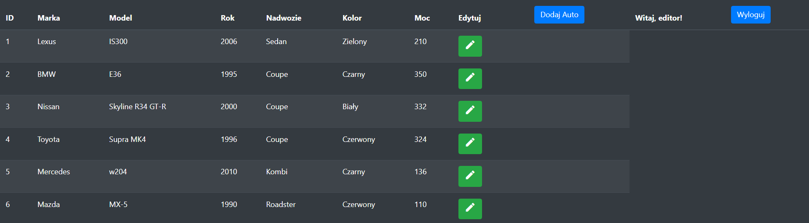

# Car Rental Management System 🚗
App includes:
  - Login and Registration Form with validation
  - Admin, editor and user panel
    
## Technologies and versions ⚙️🔧
[](https://skillicons.dev)

Project is created with:
  - HTML5
  - CSS3
  - PHP v7.4.11
  - MySQL 
  - JavaScript
  - jQuery v3.5.1
  - Bootstrap v4.5.3

## Screenshots 📷🖥️
### Login and register form


### Admin View
```
You can test it yourself.
login: admin
password: admin
```

### Editor View
```
You can test it yourself.
login: editor
password: editor
```

### User View
```
You can test it yourself.
login: user
password: user
```

### CRUD Operations
#### Add new car

#### Edit car data

#### Delete car


## Todo 📝
- Add Image Upload Button
- Reservation/Booking module
